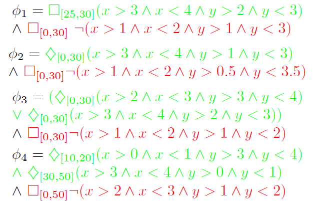
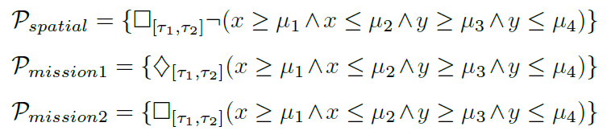

## Experiments

We considered a set of motion planning scenarios in a 2-dimensional space.
We applied active learning of STL Formulae to 4 examples:

### Learning mission and spatial preference

In this experiment, the goal is to learn the entire STL target specifications.

See `exp-1a.py`, `exp-2a.py`, `exp-3a.py` and `exp-4a.py`.

### Learning spatial preference only

In this experiment, we consider a setting where the mission is already known, but the spatial preference remains to be inferred.

See `exp-1b.py`, `exp-2b.py`, `exp-3b.py` and `exp-4b.py`.

### Learning with spatial and mission primitives

In this experiment, we consider the case of learning with a set of primitives which fit better the motion planning scenarios.

In opposition to the other experiments, where the decision-tree is based on first-order primitives (as defined in Bombara et al., "A decision tree approach to data classification using signal temporal logic," in Proceedings of the 19th International Conference on Hybrid Systems: Computation and Control. ACM, 2016, pp. 1–10), we consider a set of spatial and motion primitives defined as follows:

See `exp-1c.py`, `exp-2c.py`, `exp-3c.py` and `exp-4c.py`.
